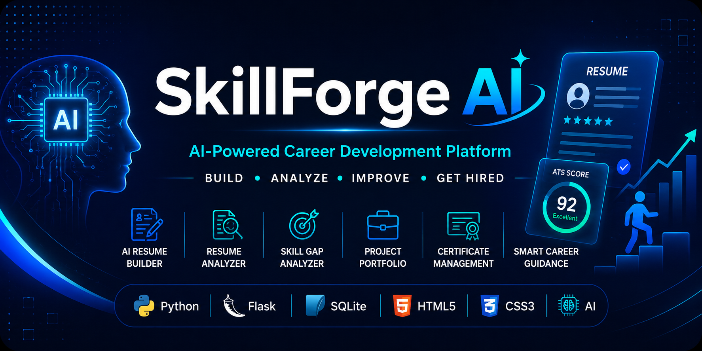
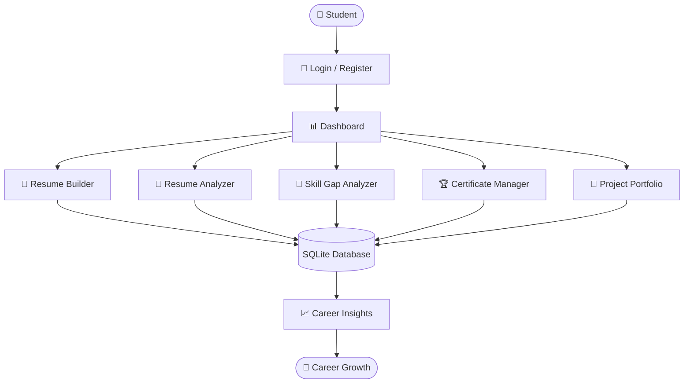

<p align="center">
  
</p>
An AI-powered career development platform built with Flask, Python, and SQLite that helps students build professional resumes, analyze ATS compatibility, identify skill gaps, and plan their learning journey.

<p align="center">


<p align="center">

<a href="https://github.com/Likith301206/SkillForge-AI">

</a>

<a href="https://www.linkedin.com/in/likith30/">

</a>

<a href="https://likith30.github.io">

</a>

</p>
An AI-powered...

---

 📖 Overview

SkillForge AI is a full-stack web application developed to assist students in improving their career readiness through AI-assisted tools.

The platform combines resume building, resume analysis, ATS scoring, project management, skill tracking, certificate management, and personalized learning guidance into a single application.

Rather than using multiple websites for different career-related tasks, SkillForge AI provides a centralized platform where students can organize and improve their professional profile.

---

❓ Problem Statement

Students often struggle with:

- Creating professional resumes
- Understanding ATS compatibility
- Identifying skill gaps
- Organizing certificates and projects
- Planning a structured learning roadmap

Existing solutions usually focus on only one of these problems.

---

 💡 Solution

SkillForge AI provides an integrated platform that enables students to:

- Build professional resumes
- Analyze resumes using AI-powered scoring
- Receive ATS compatibility feedback
- Track technical skills
- Organize projects and certificates
- Follow personalized learning recommendations

The objective is to simplify career preparation by bringing multiple career development tools together in one platform.
---

 ✨ Core Features

 👤 User Authentication
- Secure user registration and login
- Personalized dashboard for every user

---

 📄 AI Resume Builder
- Create professional resumes
- Download resumes in PDF format
- Easy-to-use resume editor

---

🤖 AI Resume Analyzer
- Analyze uploaded resumes
- Generate ATS compatibility score
- Provide resume improvement suggestions
- OCR support for resume extraction

---

🎯 Skill Gap Analyzer
- Compare current skills with industry requirements
- Generate personalized learning recommendations
- Supports multiple career paths including:
  - Python Developer
  - Java Developer
  - Frontend Developer
  - Backend Developer
  - MERN Stack Developer
  - MEAN Stack Developer
  - C# Developer
  - C++ Developer

---

🏆 Certificate Management
- Store and organize professional certifications
- Maintain a digital record of achievements

---

 💼 Project Portfolio
- Add academic and personal projects
- Track technologies used
- Build a professional project portfolio

---

🧠 Skill Management
- Track technical skills
- Organize learning progress
- Maintain an updated developer profile

---

🛠 Tech Stack

  Backend
- Python
- Flask

 Frontend
- HTML5
- CSS3
- JavaScript

 Database
- SQLite

 AI Concepts
- Resume Analysis
- ATS Score Evaluation
- Skill Gap Analysis
- OCR-based Resume Processing

 Development Tools
- VS Code
- Git
- GitHub
  ---

 🏗️ System Workflow



---

  📂 Project Structure

```text
SkillForge-AI/
│
├── assets/
│   └── images/
│
├── static/
│   ├── css/
│   ├── js/
│   └── uploads/
│
├── templates/
│
├── database/
│
├── app.py
├── career_data.py
├── requirements.txt
├── README.md
└── .gitignore
```
---
#📸 Application Preview

| Login | Dashboard |
|--------|-----------|
| Coming Soon | Coming Soon |

| Resume Builder | Resume Analyzer |
|----------------|-----------------|
| Coming Soon | Coming Soon |

| Skill Gap Analyzer | Certificate Manager |
|---------------------|---------------------|
| Coming Soon | Coming Soon |

 🗄️ Database Design

The project uses **SQLite** as its database to manage application data efficiently.

 Main Modules

- 👤 User Management
- 📄 Resume Management
- 🤖 Resume Analysis
- 🧠 Skill Tracking
- 💼 Project Management
- 🏆 Certificate Management
- 🎯 Career Roadmap

The modular database design allows different features to interact while maintaining organized and scalable data storage.

---

 ⚙️ Installation

 Clone the repository

```bash
git clone https://github.com/Likith301206/SkillForge-AI.git
```

 Navigate to the project

```bash
cd SkillForge-AI
```

 Install dependencies

```bash
pip install -r requirements.txt
```

 Run the application

```bash
python app.py
```

Open your browser:

```
http://127.0.0.1:5000
```

---

 🌐 Deployment

The application can be deployed using platforms such as:

- Render
- Railway
- PythonAnywhere
- Azure App Service

Future versions will include a live hosted demo.


 🚀 Future Roadmap

The following enhancements are planned for future releases of SkillForge AI:

- 🤖 AI-powered interview preparation
- 🎯 Personalized career recommendations
- 📚 AI-generated learning roadmaps
- 💬 AI career assistant chatbot
- 📊 Advanced analytics dashboard
- 📱 Mobile-responsive interface
- ☁️ Cloud database integration
- 🔐 OAuth login (Google & GitHub)
- 🌐 Live deployment with CI/CD

---

 📚 What I Learned

Developing SkillForge AI helped me strengthen my skills in:

- Full-Stack Web Development
- Python Programming
- Flask Framework
- Database Design with SQLite
- Authentication & Session Management
- Resume Processing & ATS Concepts
- Problem Solving
- Git & GitHub
- UI Design
- Software Architecture

---

 🎯 Why SkillForge AI?

SkillForge AI was built with a simple vision:

> **Help students prepare for their careers by bringing resume building, resume analysis, skill tracking, and career planning into one easy-to-use platform.**

Instead of switching between multiple tools, students can manage their career development from a single application.

---

 🤝 Contributing

Contributions, ideas, and suggestions are welcome.

If you'd like to improve SkillForge AI:

1. Fork the repository
2. Create a new feature branch
3. Commit your changes
4. Open a Pull Request

---

 👨‍💻 Author

 Likith S

Computer Science Engineering Student

💼 LinkedIn: https://www.linkedin.com/in/likith30/

💻 GitHub: https://github.com/Likith301206

⭐ Passionate about Software Development, Artificial Intelligence, and Full-Stack Development.

---

 
